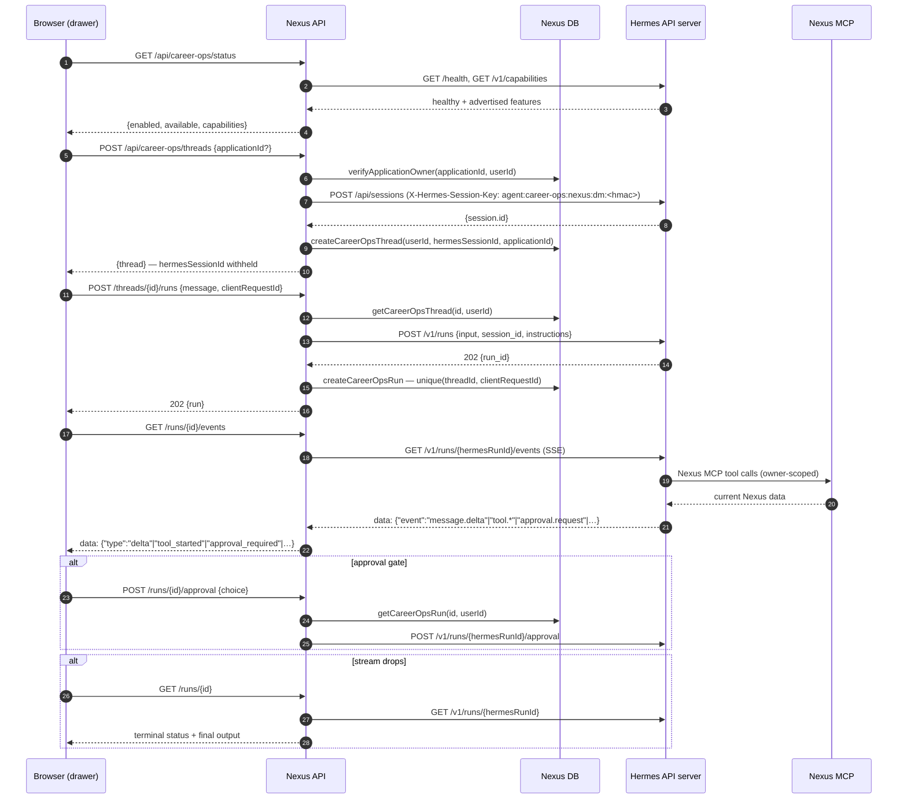

# Hermes Career Ops architecture

Career Ops gives an authenticated Nexus user a browser conversation with the external **Hermes** Career Ops agent — the same persona, skills, Nexus MCP access, and long-term memory that agent uses on other channels — without leaving the pipeline they are working on.

The integration deliberately adds **no second agent runtime and no second system of record**. Hermes reasons and runs tools; Nexus owns identity, authorization, and the CRM data. The only new Nexus-side state is a minimal mapping that lets Nexus decide which Hermes session or run a request may touch.

- **Web and API:** Next.js 16 App Router, React 19
- **Agent runtime:** external Hermes API server (not in this repository)
- **Persistence:** shared `DatabaseAdapter` — Prisma/PostgreSQL and Firestore
- **Authentication:** Better Auth browser sessions (`requireSessionAuth`)
- **Transport to Hermes:** server-to-server HTTP with a bearer token, ideally over loopback

Disabled by default. With no `HERMES_CAREER_OPS_*` configuration the status endpoint reports the feature unavailable and the UI trigger is never rendered.

## System boundary

```text
Browser (same-origin only)
  │ authenticated HTTPS, session cookie
  ▼
Next.js route handlers — /api/career-ops/*
  ├─ requireSessionAuth()            browser sessions only; API tokens rejected
  ├─ bounded body + per-user limit   32 KB body, 8 000-char message
  └─ ownership resolution            CareerOpsThread / CareerOpsRun by userId
  │
  ▼
lib/career-ops/service.ts   ← the single choke point
  │  fixed operation allowlist; no caller-supplied path, method or header
  ▼
lib/career-ops/hermes-client.ts ──► Hermes API server  (127.0.0.1:8642/p/career-ops)
                                      │
                                      ├─ Career Ops profile: persona, skills
                                      ├─ Nexus MCP  ──────► Nexus REST (owner-scoped)
                                      └─ web / job-source tools
```

The browser never learns the Hermes base URL, never receives the bearer token, and never opens a connection to the Hermes host. Because every request is same-origin, the existing Content-Security-Policy is unchanged.

## Request and stream sequence



## Why the Runs API, and what that costs

The Hermes session chat-stream endpoint couples a turn to one HTTP response: losing the response loses the turn, and it exposes no run identifier to stop or approve. `POST /v1/runs` returns a `run_id` immediately (202) and gives a separate event stream, pollable status retained for an hour, plus `stop` and `approval` control endpoints.

The cost is that **the Hermes run event stream is single-consumer**: its handler discards the run's event queue when a subscriber disconnects, so a dropped stream cannot be resumed and the events emitted while disconnected are gone. Nexus does not paper over this. On a drop the drawer enters an explicit *reconnecting* state and settles from `GET /api/career-ops/runs/{id}`; the final answer is recovered from the run's `output`, and full history from the session's messages. Buffering the stream server-side would fix it, but only by turning Nexus into a transcript store — exactly what this design avoids.

## Idempotency

`POST /v1/runs` has no `Idempotency-Key` support (only the chat-completions and responses endpoints do), so retry safety lives in Nexus. Every run submission carries a bounded `clientRequestId` (`[A-Za-z0-9_-]{8,64}`), and `CareerOpsRun` holds a unique constraint on `(threadId, clientRequestId)`. A duplicate resolves to the run that already exists; the losing upstream run is stopped best-effort and, having no mapping, is unreachable.

Firestore has no unique index, so the same guarantee is expressed as a deterministic document id derived from the pair — `create()` fails when the document exists. The adapter contract suite asserts both backends behave identically.

## Data ownership

| Concern | Owner |
| --- | --- |
| Applications, contacts, documents, events, submissions, follow-ups | **Nexus** (via Nexus MCP) |
| Agent reasoning, persona, skills, tool execution, run lifecycle | **Hermes** |
| Conversation transcript | **Hermes** (read on demand; not copied into Nexus) |
| Nexus user identity and session | **Nexus** |
| Thread → Hermes session, run → Hermes run mapping | **Nexus** |
| Application scope of a conversation | **Nexus** (`applicationId` only) |

Nexus stores no message bodies, no reasoning traces, no tool arguments, and no credentials for this feature.

## Application context

An application-scoped conversation persists only the owner-verified `applicationId`. Each run sends instructions naming that id plus a bounded company/role label, and tells the agent to retrieve current facts through the Nexus MCP tools. The job description is never sent and never duplicated into an agent-side store, so a conversation left open overnight still acts on today's record. Text stored in Nexus is explicitly framed to the agent as user data, not instructions.

## Long-term memory scope

Requests carry `X-Hermes-Session-Key: agent:career-ops:nexus:dm:<32 hex>`, where the suffix is `HMAC-SHA256(scope secret, userId)`. It is stable per user, differs between users, contains no email address or other personal identifier, and stays well inside the header's 256-character limit. Browser conversations use Nexus-created Hermes sessions, so they share the agent's long-term memory without reading any other channel's transcript.

## Error mapping

| Upstream | Nexus | Rationale |
| --- | --- | --- |
| 401 / 403 | 503 `unavailable` | Nexus' own credential was rejected — an operator problem, not the user's |
| 404 | 404 | |
| 409 | 409 `conflict` | e.g. the run is no longer awaiting approval |
| 429 | 429 + `Retry-After` | |
| 5xx, network, timeout | 502 `upstream_error` | |

Response bodies are always Nexus-authored. Upstream text passes through `redactUpstreamError()` before it can reach a log line, and never reaches a response body.

## Related documents

- [Threat model](../security/hermes-career-ops-threat-model.md)
- [Hermes profile setup and deployment](../operations/hermes-career-ops-setup.md)
- OpenSpec change: `openspec/changes/integrate-hermes-career-ops/`

## Relationship to the AI operator console

The existing [AI operator console](./ai-operator-console.md) is unchanged and untouched. It runs a generic assistant *inside* Nexus on the user's own provider key. Career Ops runs *no* model in Nexus and adds no provider SDK or provider-key storage. The two features share no routes, tables, or components.

Career Ops is a browser-session feature and, like `/api/agent/*`, is not part of the API-token REST surface documented in `public/openapi.json`.
